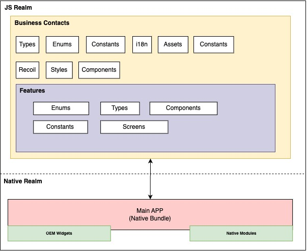

# Description

#### React Native based cross-platform application for manage digital business cards. You can add new business card, delete and save business card as phone contact.

The application written using standard coding practices and guidelines by using *TypeScript* and *Functional Programming* principles.

# Installation

1. clone the repos
2. `yarn install`
3. For ios run `npx react-native run-ios`
4. For ios run `npx react-native run-android`
5. Rehydrate repo `npm run repo/rehydrate`

# Folder Structure
#### Good folder structure helps to easy manage, reading, less duplication and long term project management

> BusinessContacts/
> ├── diagrams/  - *contains project design diagram*  
> ├── scripts/  - *contains project related shell scripts*  
> ├── ios/  - *contains native ios related implementations*  
> ├── android/ - *contains native android related implementations*   
> ├── package.json - *manage all the project related dependencies and meta data*
> ├── index.js - *app js boot up file (root file of the JS realm)*
> ├── src/ - *contains all ts/js related implementations*
> ├──── App.tsx - *Root JSX element*
> ├──── assets/ - *contains and manage app assets*
> ├──── components/ - *contains app reusable components*
> ├──── constants/ - *contains app related constants*
> ├──── enums/ - *contains project enumerations*
> ├──── features/ - *manage different features separately (Note: The location for feature wise screens, styles, components and etc.)*
> ├────── business-card/
> ├──────── components/ - *contains business-card feature related reusable components*
> ├──────── screens/ - *contains business-card feature related screens*
> ├────────── home/ - *contains HomeScreen jsx implementation*
> ├──────────── HomeScreen.ts - *contains HomeScreen jsx implementation*
> ├──────────── HomeScreen.styles.ts - *contains HomeScreen jsx elements styles*
> ├──── helper/ - *contains helper function (eg: validation )*
> ├──── i18n/ - *contains multilingual implementation and translations files*  
> ├──── navigator/ - *contains app navigator implementations*  
> ├──── providers/ - *contains app providers (eg: AppProvider, NavigationProvider)*
> ├──── recoil/ - *contains app state (global state) and app state utility implementations*  
> ├──── styles/ - *contains generic styles, colors, common scaling, common spacing*  
> ├──── theme/ - *contains app theme (Note: App user able to manually change to light mode and dark mode, currently the implementation disabled)*  
> ├──── types/ - *contains typescript types*  
> ├──── typography/ - *contains app typography (Note: App typography helps to manage one place to handle standardized typo and font )*  
> ├──── utils/ - *contains app utility implementation (eg: request permission, hexToRgb)*  

# Packages

- [Recoil](https://github.com/facebookexperimental/Recoil) recoil light weight latest facebook experimental global state managing plugin. This can use for alternative solution for redux
- [react-native-vector-icons](https://github.com/oblador/react-native-vector-icons) this library comes with well-known icon libraries in vector format (eg: feather icons)
- [react-native-permissions](https://github.com/zoontek/react-native-permissions) for manage ios/android app permissions
- [react-native-contacts](https://github.com/morenoh149/react-native-contacts) manage access the phone contacts
- [react-native-encrypted-storage](https://github.com/emeraldsanto/react-native-encrypted-storage) for access persistent storage
- [react-navigation](https://reactnavigation.org/) for manage screen navigation
- [i18next](https://www.i18next.com/) for multilingual
- [husky](https://typicode.github.io/husky/#/) git hooks tool, In this project husky works as pre-commit trigger for lint-stage
- [lint-staged](https://github.com/okonet/lint-staged) lint checker for husky

# Diagram
## High-level diagram of the project

